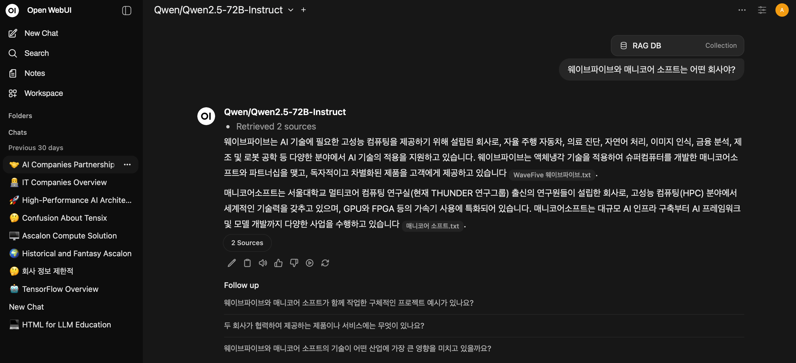

# TT-Chat demo

- Open-WebUI demo with [tt-inference-server](https://github.com/tenstorrent/tt-inference-server) for LLM serving and [docling]() and document processing
- Temporarily using [ollama]() for embedding models

# Demo



- Capable of running models in [tt-inference-server](https://github.com/tenstorrent/tt-inference-server), which is a LLM model serving framework based on [vllm](https://github.com/vllm-project/vllm).

# Steps

| Below instruction sets up `Qwen/Qwen2.5-72B-Instruct` and `embeddinggemma:300m` models.

## 1. Set up SSH server, if using a remote server

```
ssh -p {SERVER_PORT} -L 8080:localhost:8080 {SERVER_ADDRESS}
```

## 2. Install basic Tenstorrent software stack

- Follow the official docs for setting up basic software stack (https://docs.tenstorrent.com/getting-started/README.html)

## 3. Spawn a tt-inference-server container

```
git pull https://github.com/tenstorrent/tt-inference-server

# Select device and model
select_device_and_model(){ echo -e "\nSelect a Tenstorrent system from the list below:"; PS3=$'\n#? '; options=("TT-QuietBox (Wormhole)" "TT-QuietBox (Blackhole)" "TT-LoudBox" "n150s" "n150d" "n300s" "n300d" "p100a" "p150a" "p150b" "Quit"); select opt in "${options[@]}"; do IS_BLACKHOLE=""; case "$opt" in "TT-QuietBox (Wormhole)") DEVICE="t3k"; MODEL="Llama-3.3-70B-Instruct";; "TT-QuietBox (Blackhole)") DEVICE="p150x4"; MODEL="Llama-3.3-70B-Instruct"; IS_BLACKHOLE="--dev-mode";; "TT-LoudBox") DEVICE="t3k"; MODEL="Llama-3.3-70B-Instruct";; "n150s"|"n150d") DEVICE="n150"; MODEL="Llama-3.1-8B-Instruct";; "n300s"|"n300d") DEVICE="n300"; MODEL="Llama-3.1-8B-Instruct";; "p100a") DEVICE="p100"; MODEL="Llama-3.1-8B-Instruct"; IS_BLACKHOLE="--dev-mode";; "p150a"|"p150b") DEVICE="p150"; MODEL="Llama-3.1-8B-Instruct"; IS_BLACKHOLE="--dev-mode";; "Quit") echo "❌ Exiting without setting any environment variables."; return;; *) echo "❌ Invalid option. Try again."; continue;; esac; export DEVICE MODEL IS_BLACKHOLE; echo -e "\n✅ DEVICE set to '$DEVICE'"; echo "✅ MODEL set to '$MODEL'"; [ -n "$IS_BLACKHOLE" ] && echo "✅ IS_BLACKHOLE set to '$IS_BLACKHOLE'"; break; done; }; select_device_and_model

# Register HuggingFace Token
export HF_TOKEN={YOUR_HF_TOKEN}

# Check HuggingFace access
check_hf_access() { [ -z "$MODEL" ] && { printf "✖ Error: Please provide a Hugging Face repository ID.\n"; return 1; }; ! command -v curl &>/dev/null && { printf "✖ Error: curl is not installed.\n"; return 1; }; local REPO_ID="meta-llama/$MODEL"; local TOKEN=${HF_TOKEN:-$(cat "$HOME/.cache/huggingface/token" 2>/dev/null)}; [ -z "$TOKEN" ] && printf "ℹ️ Info: No Hugging Face token found.\n   You can only access public repositories.\n"; local AUTH_HEADER=""; [ -n "$TOKEN" ] && AUTH_HEADER="Authorization: Bearer $TOKEN"; printf "Checking access for: %s...\n" "$REPO_ID"; local URL="https://huggingface.co/$REPO_ID/resolve/main/config.json"; local HTTP_CODE=$(curl -s -L -o /dev/null -w "%{http_code}" -H "$AUTH_HEADER" "$URL"); case $HTTP_CODE in 200) printf "✔ Access granted.\n";; 401) printf "✖ Access denied (401 Unauthorized).\n  This is a private or gated repository.\n  Ensure your token is valid and has the correct permissions.\n";; 403) printf "✖ Access forbidden (403 Forbidden).\n  The repository is gated.\n  You need to visit the repository page on Hugging Face and request access.\n";; 404) printf "✖ Repository or 'config.json' not found (404 Not Found).\n  Please check if the repository ID '$REPO_ID' is correct.\n";; *) printf "✖ Failed to check access.\n  Received HTTP status code: %s\n" "$HTTP_CODE";; esac; }; HF_HUB_DISABLE_XET=1; check_hf_access;

# Register JWT_SECRET
export JWT_SECRET="testing"

# Change model to your liking. Here, we choose Qwen/Qwen2.5-72B-Instruct
export MODEL="Qwen2.5-72B-Instruct"

# Spawn tt-inference-server
python3 run.py --model $MODEL --device $DEVICE --workflow server --docker-server $IS_BLACKHOLE

# Check server health
check_server_health(){ code=$(curl -s -o /dev/null -w "%{http_code}" http://localhost:8000/health); exit_code=$?; if [[ $exit_code -ne 0 ]]; then echo "❌ Error: Unable to connect to server at localhost:8000"; elif [[ $code -eq 200 ]]; then echo "✅ Server is ready (HTTP 200)"; else echo "⚠️ Server responded with status: $code"; fi; }; check_server_health

# Register vllm API key
python3 -m venv request-venv
source request-venv/bin/activate
pip3 install --upgrade pip
pip install pyjwt==2.7.0
export VLLM_API_KEY=$(python3 -c 'import os; import json; import jwt; json_payload = json.loads("{\"team_id\": \"tenstorrent\", \"token_id\": \"debug-test\"}"); encoded_jwt = jwt.encode(json_payload, os.environ["JWT_SECRET"], algorithm="HS256"); print(encoded_jwt)')

# Test calling vllm API
curl -sS "http://localhost:8000/v1/completions"   -H "Content-Type: application/json"   -H "Authorization: Bearer $VLLM_API_KEY"   -d "{\"model\": \"Qwen/$MODEL\", \"prompt\": \"San Francisco is a\", \"max_tokens\": 50, \"temperature\": 0}" | jq
```

Once you call the vllm API, you should get a response like below:
```
{
  "id": "cmpl-1ca67f7e52474d3884f42223b3abc617",
  "object": "text_completion",
  "created": 1762007195,
  "model": "Qwen/Qwen2.5-72B-Instruct",
  "choices": [
    {
      "index": 0,
      "text": " city that has always been at the forefront of innovation, and it’s no surprise that it’s also leading the way in sustainable living. From its commitment to reducing greenhouse gas emissions to its efforts to promote renewable energy, San Francisco is setting an example for",
      "logprobs": null,
      "finish_reason": "length",
      "stop_reason": null,
      "prompt_logprobs": null
    }
  ],
  "service_tier": null,
  "system_fingerprint": null,
  "usage": {
    "prompt_tokens": 4,
    "total_tokens": 54,
    "completion_tokens": 50,
    "prompt_tokens_details": null
  },
  "kv_transfer_params": null
}
```

## 4. Spawn Open-WebUI container

```
# Spawn Open-WebUI container, with shared host network access. 
docker run -d   --name open-webui   --privileged   --network host   -e OPENAI_API_BASE_URL=http://localhost:8000/v1   -e OPENAI_API_KEY=$VLLM_API_KEY   ghcr.io/open-webui/open-webui:main

# Check if the open-webui application is built properly and running by inspecting the logs 
docker logs -f open-webui
```

Once the open-webui application is created, open the application via `localhost:8080` on your browser.

Make an admin account, and test tt-inference-server is properly connected to open-webui.

## 5. Spawn ollama container

```
# Spawn ollama container
docker run -d --name ollama   -p 11434:11434   -v ollama:/root/.ollama   docker.io/ollama/ollama

# Inside the ollama container, pull embeddinggemma model
docker exec -it ollama bash
ollama pull embeddinggemma
exit
```

Open the open-webui application via `localhost:8080`, and log in as admin account.

Open 'Admin panel' at the left bottom pane.

Move to 'Settings'->'Documents', and change 'Embedding Model Engine' to 'ollama', and register `http:localhost:11434` as the API Base URL.

Register 'embeddinggemma' as the embedding model.

Save the settings.


## 6. Spawn docling container

```
# Spawn docling container
docker run -d -p 5001:5001 -e DOCLING_SERVE_ENABLE_UI=1 -e DOCLING_SERVE_ARTIFACTS_PATH="" --name docling quay.io/docling-project/docling-serve
```

Open the open-webui application via `localhost:8080`, and log in as admin account.

Open 'Admin panel' at the left bottom pane.

Move to 'Settings'->'Documents', and change 'Content Extraction Engine' to 'Docling', and register `http:localhost:5001` as the Docling Server URL.

Save the settings.